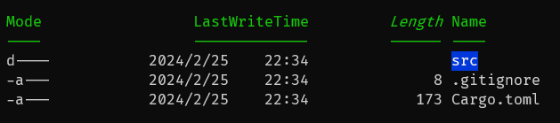

# 利用wasm实现数据传输加密反爬

> 本文的背景是开发了一个小说网站，为了避免被恶意抓接口做爬虫。
>
> 众所周知，前端页面的源码是可以随意查看的，哪怕加上无限debug、禁止控制台等操作，逆向难度也还是不高。
> 恶意用户只需要使用代理抓包即可获取到前端代码。
>
> 因此本文尝试将rust代码编译wasm，数据请求将在wasm中把参数AES加密后再进行网络请求，
> 返回的数据也是AES加密以后的，AES密钥写在rust代码中。
>
> 为了避免恶意用户直接调用编译后的wasm文件暴露的网络请求方法，rust代码将直接操作网页dom页面，不再对数据进行返回。
>

> 本文默认读者已经安装rust工具链（`rustup`、`rustc`、`cargo`）

## 安装`wasm-pack`

wasm-pack，一个构建、测试和发布 WASM 的 Rust CLI 工具，我们将使用 wasm-pack 相关的命令来构建 WASM 二进制内容。

> 下载链接：https://rustwasm.github.io/wasm-pack/installer/

打开链接后页面会根据你的操作系统提示安装流程，本文不再赘述

## 项目初始化

首先我们执行 `cargo new wasm-demo` 初始化 Rust 项目，新建一个名为 `wasm-demo`
的文件夹（也可以选一个你喜欢的文件夹名），自动生成配置文件 `Cargo.toml`，结构如下。



将配置文件`Cargo.toml`改为如下内容

```toml
[package]
name = "wasm-demo" #项目名称
version = "0.1.0"
edition = "2021"

# See more keys and their definitions at https://doc.rust-lang.org/cargo/reference/manifest.html

[lib]
crate-type = ["cdylib"] # 申明库的类型。

[dependencies]
wasm-bindgen = "0.2.91" # 简化 Rust WASM 与 JS 之间交互的库
base64 = "0.21.7"
wasm-bindgen-futures = "0.4.41" # 异步
soft-aes = "0.2.2" #aes加密
reqwest-wasm = "0.11.16" # 请求库

[dependencies.web-sys] # 操作dom
version = "0.3.68"
features = ["Document", "Element", "Window"]
```

## 编写代码

将`src/main.rs`改为`src/lib.rs`

Rust 中包管理系统将 crate 包分为二进制包（Binary）和库包（Library）两种，二者可以在同一个项目中同时存在。
二进制包：

`main.rs` 是二进制项目的入口
二进制项目可直接执行
一个项目中二进制包可以有多个，所以在 Cargo.toml 中通过双方括号标识 `[[bin]]`

库包：

`lib.rs` 是库包的入口。
库项目不可直接执行，通常用来作为一个模块被其他项目引用。
一个项目中库包仅有1个，在 Cargo.toml 中通过单方括号标识 `[lib]`

因为我们这里希望将 WASM 转为一个可以在 JS 项目中使用的模块，所以需要使用库包 lib.rs 的命名。

代码内容：

```rust
use wasm_bindgen::prelude::*;
use base64::{engine::general_purpose::STANDARD, Engine as _};
use soft_aes::aes::{aes_enc_ecb, aes_dec_ecb};
use reqwest_wasm::get;

const KEY: &[u8; 16] =b"1234567890asdfgh";


// 将文本内容转为html格式
fn parse_novel(mut novel: String) -> String {
    // 换行符替换为<br>
    novel = novel.replace("\n", "<br><br>");
    return novel;
}

// #[wasm_bindgen] 标注告诉 wasm-pack 需要将这个函数编译成 wasm 可执行文件。
#[wasm_bindgen]
pub async fn download(download_url: &str) -> Result<String, JsValue> {
    let base_url = "下载地址";
    // 将 download_url 添加到url parmas download_url进行aes加密
    let url = format!("{}?downloadUrl={}", base_url, encrypt(download_url.parse().unwrap()));
    let res = get(url).await?;
    let status_code = res.status();
    if status_code != 200 {
        return Err(JsValue::from_str("fetch failed with status"));
    }
    let text = res.text().await.unwrap();
    let text = parse_novel(decrypt(text)); //将返回的内容进行aes解密
    let document = web_sys::window().unwrap().document().unwrap(); //获取网页document
    let element = document.get_element_by_id("content").unwrap(); //获取要修改的元素
    element.set_inner_html(&*text); //设置元素html
    Ok("获取成功".parse().unwrap())
}


fn encrypt(plain_text: String) -> String {
    // Pkcs7Padding 填充
    let res = aes_enc_ecb(plain_text.as_bytes(), KEY, Option::from("PKCS7")).unwrap();
    STANDARD.encode(res)
}


fn decrypt(cipher_text: String) -> String {
    let cipher_text = STANDARD.decode(cipher_text).unwrap();
    let res = aes_dec_ecb(&*cipher_text, KEY, Option::from("PKCS7")).unwrap();
    String::from_utf8(res).unwrap()
}

```

## 执行编译
在项目根目录执行以下代码
```shell
wasm-pack build
```
编译完成后，我们会发现根目录下多了一个 `pkg/` 文件夹，里面就是我们的 WASM 产物所在的 npm 包了。

导入wasm及使用这里不再赘述，可以自行查看生成的npm包暴露的方法。
