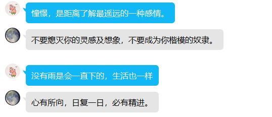
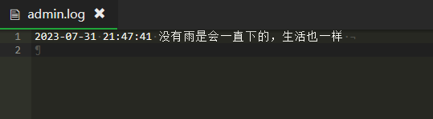

> 本文将简单介绍如何使用golang编写一个简单的websocket客户端，基于之前文章《QQ机器人 Mirai搭建及签名服务器》的基础上，我们将使用golang编写一个websocket客户端，通过websocket与QQ机器人进行通信，实现QQ机器人帮我记日志的功能。
>
> Mirai支持http、websocket协议传输数据
> 
> 文档：https://github.com/project-mirai/mirai-api-http/blob/master/docs/adapter/WebsocketAdapter.md
> 
> 本文将使用websocket协议传输数据, 非常简陋，原计划时制作一个符合规范的项目，但是中途懒狗了，所以就这样吧，有时间再完善吧。
> 
> 程序读取配置文件中的配置，当管理员发送消息给机器人时，机器人将消息保存来下，并记录发送消息的时间，处理完成后机器人将通过开放接口获取随机格言返回给管理员。
> 
> 效果如下





## 1. 项目结构
```bash
├── wsMirai
│   ├── base
│   │   ├── config.go # 配置文件的读取
│   │   ├── init.go # 初始化
│   │   ├── logger.go # 日志 也没用上
│   │   └── validate.go #验证器 本来想做的完善一点的 但是....所以没用上
│   └── bot.go # 连接机器人
├── go.mod
├── go.sum
├── mirai.yaml # 配置文件
└── main.go #入口
```

## 2. 项目代码
### go.mod
```bash
module logBot

go 1.20

require (
	github.com/go-playground/locales v0.14.1
	github.com/go-playground/universal-translator v0.18.1
	github.com/go-playground/validator/v10 v10.14.1
	github.com/sirupsen/logrus v1.9.3
	gopkg.in/yaml.v3 v3.0.1
)

require (
	github.com/gabriel-vasile/mimetype v1.4.2 // indirect
	github.com/gorilla/websocket v1.5.0 // indirect
	github.com/leodido/go-urn v1.2.4 // indirect
	github.com/tidwall/gjson v1.15.0 // indirect
	github.com/tidwall/match v1.1.1 // indirect
	github.com/tidwall/pretty v1.2.1 // indirect
	golang.org/x/crypto v0.7.0 // indirect
	golang.org/x/net v0.8.0 // indirect
	golang.org/x/sys v0.6.0 // indirect
	golang.org/x/text v0.8.0 // indirect
)
```
### 配置文件，使用yaml格式
```yaml
type: ws
qq: 123456789
verifyKey: 123456
host: 127.0.0.1
# 端口号
port: 8084
# 是否启用单例模式
singleMode: false
# 是否启用日志
enableLog: true
# 0: panic, 1: fatal, 2: error, 3: warn, 4: info, 5: debug, 6: trace
logLevel: 5
admin: 12345678
```
### config.go
```go
package base

import (
	"gopkg.in/yaml.v3"
	"os"
)

var config *ConfigStruct

type ConfigStruct struct {
	Type       string `json:"type" yaml:"type" validate:"required,oneof=ws http" tag:"连接类型"`
	QQ         int64  `json:"qq" yaml:"qq" tag:"QQ号" validate:"required_unless=SingleMode true"`
	VerifyKey  string `json:"verifyKey" yaml:"verifyKey" validate:"required" tag:"验证密钥"`
	Host       string `json:"host" yaml:"host" validate:"required,ip" tag:"服务器地址"`
	Port       uint16 `json:"port" yaml:"port" validate:"required" tag:"服务器端口"`
	SingleMode bool   `json:"singleMode" yaml:"singleMode" validate:"" tag:"单例模式"`
	EnableLog  bool   `json:"enableLog" yaml:"enableLog" validate:"" tag:"启用日志"`
	LogLevel   uint32 `json:"logLevel" yaml:"logLevel" validate:"required_if=EnableLog true,lte=6,gte=1" tag:"日志等级"`
	Admin      int64  `json:"admin" yaml:"admin" validate:"required" tag:"管理员QQ号"`
}

func initConfig() {
	// 判断当前文件夹内是否存在 mirai.yaml 文件
	// 如果存在则读取该文件,没有则报错退出
	// 读取文件后,将文件内容解析为 ConfigStruct 结构体
	// 将 ConfigStruct 结构体赋值给 config 变量
	f, err := os.Open("mirai.yaml")
	if err != nil {
		panic(err)
	}
	defer func(f *os.File) {
		err := f.Close()
		if err != nil {
			logger.Errorln("关闭配置文件失败" + err.Error())
		}
	}(f)
	err = yaml.NewDecoder(f).Decode(&config)
	if err != nil {
		logger.Errorln("读取配置文件失败" + err.Error())
	}
}

func checkConfig() {
	// 检查 ConfigStruct 结构体是否符合要求
	// 如果不符合要求则报错退出
	// 如果符合要求则继续执行
	err := validate.Struct(config)
	if err != nil {
		println(ParseError(err))
	}
}

func GetConfig() *ConfigStruct {
	return config
}
```
### logger.go
```go
package base

import (
	"github.com/sirupsen/logrus"
	"io"
	"os"
)

var (
	logger     = logrus.New()
	loggerFile *os.File
)

func initLog() {
	// 判断 log 文件夹是否存在 如果不存在则创建
	if _, err := os.Stat("log"); os.IsNotExist(err) {
		err := os.Mkdir("log", os.ModePerm)
		if err != nil {
			panic(err)
		}
	}
	// 打开 log 文件
	var err error
	loggerFile, err = os.OpenFile("log/app.log", os.O_APPEND|os.O_CREATE|os.O_RDWR, 0666)
	if err != nil {
		logger.Println("打开 log 文件失败:" + err.Error())
	}
	// 设置 log 输出 为标准输出和文件输出
	if config.EnableLog {
		logger.SetOutput(io.MultiWriter(os.Stdout, loggerFile))
	} else {
		logger.SetOutput(os.Stdout)
	}
	logger.SetFormatter(&logrus.TextFormatter{
		DisableColors: true,
		FullTimestamp: true,
	})
	logger.SetReportCaller(true)
	logger.SetLevel(logrus.Level(config.LogLevel))
}

func GetLogger() *logrus.Logger {
	return logger
}
```
### validate.go
```go
package base

import (
	"github.com/go-playground/locales/zh"
	ut "github.com/go-playground/universal-translator"
	"github.com/go-playground/validator/v10"
	zhTranslation "github.com/go-playground/validator/v10/translations/zh"
	"reflect"
	"strings"
)

var (
	trans    ut.Translator
	validate *validator.Validate
)

func initTranslate() {
	//初始化错误翻译器
	trans, _ = ut.New(zh.New()).GetTranslator("zh")
	validate = validator.New()
	//使用fld.Tag.Get("comment")注册一个获取tag的自定义方法以实现翻译Field
	validate.RegisterTagNameFunc(func(fld reflect.StructField) string {
		return fld.Tag.Get("tag")
	})
	_ = validate.RegisterTranslation("isdefault", trans, func(ut ut.Translator) error {
		return ut.Add("isdefault", "{0}应当为默认值", true)
	}, func(ut ut.Translator, fe validator.FieldError) string {
		t, _ := ut.T("isdefault", fe.Field())
		return t
	})

	err := zhTranslation.RegisterDefaultTranslations(validate, trans)
	if err != nil {
		logger.Error("注册错误翻译器失败：" + err.Error())
	}

	logger.Info("注册错误翻译器成功")
}
func GetValidate() *validator.Validate {
	if validate == nil {
		initTranslate()
	}
	return validate
}

func GetTrans() ut.Translator {
	return trans
}

// 解析错误信息
func ParseError(err error) string {
	switch err.(type) {
	case nil:
		return ""
	case validator.ValidationErrors:
		println("ValidationErrors")
		err := err.(validator.ValidationErrors)
		var errMses []string
		for _, e := range err.Translate(trans) {
			errMses = append(errMses, e)
		}
		return strings.Join(errMses, "\r\n")
	default:
		errInfo := err.Error()
		switch {
		default:
			return errInfo
		}
	}
}
```


###  init.go
`原计划有多个初始化函数，但是后来懒了，所以就这样吧`
```go
package base

func init() {
	initConfig()
    initLog()
	initTranslate()
	checkConfig()
}
```
### bot.go
```go
package wsMirai

import (
	"github.com/gorilla/websocket"
	"logBot/wsMirai/base"
	"net/url"
	"strconv"
)

var (
	logger = base.GetLogger()
)

type Bot struct {
	Config  *base.ConfigStruct
	Connect *websocket.Conn
}

func NewBot(config *base.ConfigStruct) *Bot {
	return &Bot{Config: config}
}

func (bot *Bot) ConnectServer(path string) *websocket.Conn {
	if bot.Config.Type != "ws" {
		logger.Panicln("当前连接类型不是ws")
	}
	params := url.Values{}
	params.Add("verifyKey", bot.Config.VerifyKey)
	if !bot.Config.SingleMode {
		params.Add("qq", strconv.FormatInt(bot.Config.QQ, 10))
	}
	u := url.URL{
		Scheme:   "ws",
		Opaque:   "",
		User:     nil,
		Host:     bot.Config.Host + ":" + strconv.Itoa(int(bot.Config.Port)),
		Path:     path,
		RawQuery: params.Encode(),
	}
	logger.Infoln("连接地址: " + u.String())
	c, _, err := websocket.DefaultDialer.Dial(u.String(), nil)
	if err != nil {
		logger.Panicln("连接失败: " + err.Error())
	}
	bot.Connect = c
	return c
}
```
### main.go
```go
package main

import (
	"github.com/sirupsen/logrus"
	"github.com/tidwall/gjson"
	"io"
	"log"
	"logBot/wsMirai"
	"logBot/wsMirai/base"
	"net/http"
	"os"
	"os/signal"
	"time"
)

func initBot(config *base.ConfigStruct) *wsMirai.Bot {
	if config == nil {
		config = base.GetConfig()
	}
	bot := wsMirai.NewBot(config)
	c := bot.ConnectServer("/message")
	if c == nil {
		return nil
	}
	return bot
}

func monitorMessage(bot *wsMirai.Bot) {
	c := bot.Connect
	for {
		_, message, err := c.ReadMessage()
		if err != nil {
			logrus.Println("读取消息失败:", err)
			return
		}
		data := gjson.ParseBytes(message).Get("data")
		processMessages(bot, data)
	}
}

func getRandomMessage() string {
	u := "https://v1.hitokoto.cn/"
	resp, err := http.Get(u)
	if err != nil {
		log.Println("获取一言失败:", err.Error())
		return "今日无言"
	}
	defer func(resp *http.Response) {
		err := resp.Body.Close()
		if err != nil {
			log.Println("关闭请求失败:", err.Error())
		}
	}(resp)
	body, err := io.ReadAll(resp.Body)
	if err != nil {
		log.Println("读取请求失败:", err.Error())
		return "今日无言"
	}
	return gjson.ParseBytes(body).Get("hitokoto").String()
}

func recordAdminMessages(bot *wsMirai.Bot, message gjson.Result) {
	texts := message.Get(`messageChain.#(type=="Plain")#.text`).Array()
	var text string
	for _, v := range texts {
		text += v.String() + " "
	}
	sendTime := message.Get(`messageChain.#(type=="Plain")#.0.time`).Int()
	sendTimeStr := ""
	if sendTime == 0 {
		sendTimeStr = time.Now().Format("2006-01-02 15:04:05")
	} else {
		sendTimeStr = time.Unix(sendTime, 0).Format("2006-01-02 15:04:05")
	}
	f, err := os.OpenFile("admin.log", os.O_CREATE|os.O_APPEND|os.O_WRONLY, 0666)
	if err != nil {
		log.Println("打开文件失败:", err.Error())
		return
	}
	defer func(f *os.File) {
		err := f.Close()
		if err != nil {
			log.Println("关闭文件失败:", err.Error())
		}
	}(f)
	_, err = f.WriteString(sendTimeStr + " " + text + "\n")

	returnContent := map[string]interface{}{
		"target": bot.Config.Admin,
		"messageChain": []map[string]interface{}{
			{
				"type": "Plain",
				"text": getRandomMessage(),
			},
		},
	}
	returnMsg := map[string]interface{}{
		"syncId":     123,                 // 消息同步的字段
		"command":    "sendFriendMessage", // 命令字
		"subCommand": nil,                 // 子命令字, 可空
		"content":    returnContent,       // 消息内容
	}

	err = bot.Connect.WriteJSON(returnMsg)
	if err != nil {
		log.Println("发送消息失败:", err.Error())
		return
	}
}

func processFriendMessages(bot *wsMirai.Bot, message gjson.Result) {
	senderId := message.Get("sender.id").Int()
	remark := message.Get("sender.remark").String()
	nickname := message.Get("sender.nickname").String()
	name := remark
	if remark == "" {
		name = nickname
	}
	text := ""
	for _, v := range message.Get(`messageChain.#(type=="Plain")#.text`).Array() {
		text += v.String() + " "
	}
	log.Println("收到好友消息:", name, senderId, text)
	if senderId == bot.Config.Admin {
		recordAdminMessages(bot, message)
	}
}

func processMessages(bot *wsMirai.Bot, message gjson.Result) {
	typeStr := message.Get("type").String()
	switch typeStr {
	case "FriendMessage":
		// 处理好友消息
		processFriendMessages(bot, message)
	}
}

func main() {

	// 捕获程序退出信号
	// 退出时关闭连接

	bot := initBot(nil)
	if bot == nil {
		return
	}
	go monitorMessage(bot)

	quit := make(chan os.Signal)
	signal.Notify(quit, os.Interrupt)
	<-quit
	log.Println("关闭链接 ...")
	err := bot.Connect.Close()
	if err != nil {
		log.Println("关闭链接失败:", err.Error())
		return
	}
	logrus.Println("Shutdown Server ...")
}
```